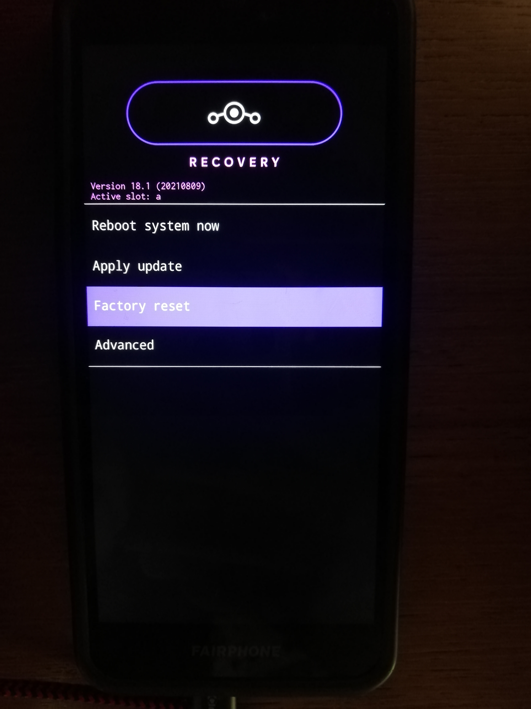
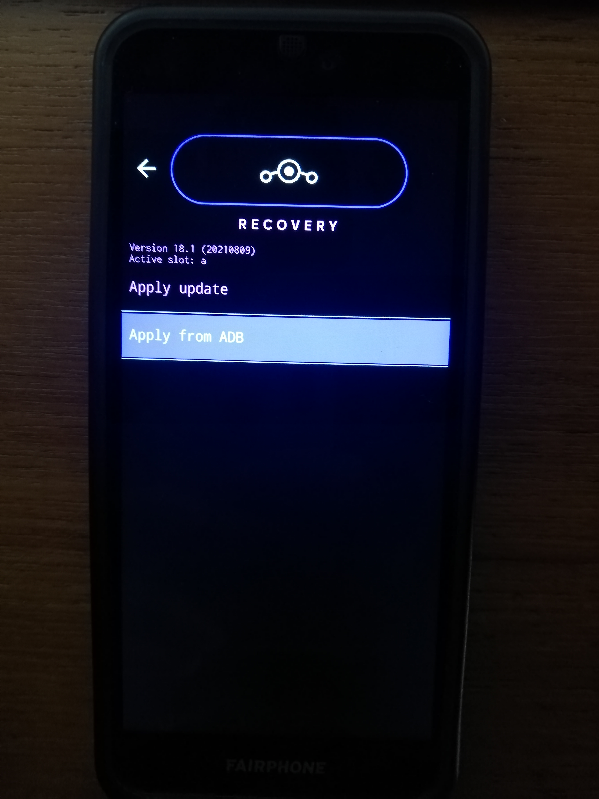
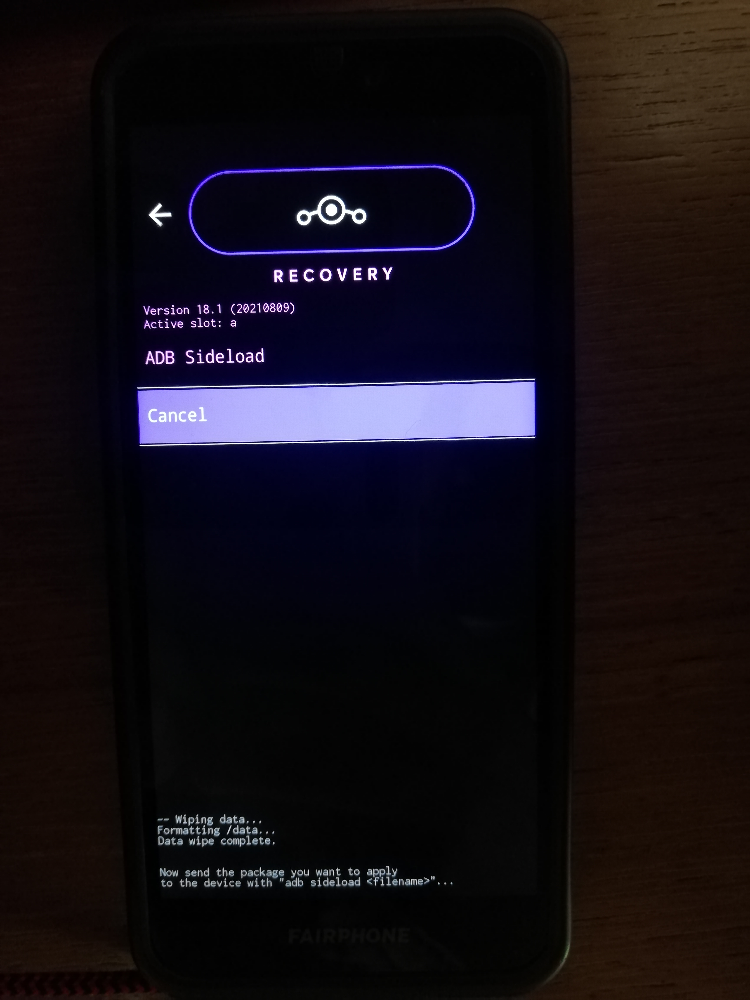

# Install LineageOS on Fairphone

## 1. Checklist before starting

[ ] adb and fastboot are installed on the computer?  
[ ] you downloaded the bootimage (img) and LineageOS (zip)?  
[ ] you have the unlock code (in case of Fairphone 3)?  
[ ] you have an usb cable ready?  
[ ] you have removed your screen lock?
[ ] your phone has at least 70% battery?
[ ] you are prepared to erase all the data on your Fairphone?

## 2. Unlock your Fairphone

Unlocking will allow us to overwrite the boot-loader.

1. Navigate to "Settings - About phone"
1. Tap on “Build number” 7 times to enable developer mode
1. Navigate to "Settings - System – Advanced – Developer options"
1. Enable USB Debugging
1. In case of Fairphone3:
   1. Navigate to "Settings - System – Advanced – Developer options"
   1. Enable OEM unlocking with your unlock code

## 3. Connect via usb

For overwriting the boot-loader of your Fairphone, it needs to be connected to your pc.

1. Connect your Fairphone to the computer via usb
1. On your Fairphone allow the usb connection
1. Type `adb devices` on your terminal (for Windows users: open the terminal in the directory containing adb&fastboot.exe and use the `.\` prefix. The resulting command will be: `.\adb devices`).   
   The result should show something like   
   ```
   List of devices attached
   <SerialNumberOfYourPhone>    device
   ```

## 4. Prepare recovery image installation

The next step is critical. If something goes wrong here your Fairphone may remain broken. Time to do some checks:

1. Make sure your phone has at least 70% battery.
1. Reboot your Fairphone to bootloader mode: Type `adb reboot bootloader` on the terminal.
1. Your Fairphone should show the bootloader screen.  
1. Type `fastboot devices` on the terminal. The result should show something like   
   ```
   <SerialNumberOfYourPhone>    fastboot
   ```
1. Check your downloaded recovery image
   1. In Windows type `Get-FileHash <image_filename.img>` on the terminal.
   1. in Linux type `sha256sum <image_filename.img>` or alternatively `shasum -a 256 <image_filename.img>` on the terminal.
1. The result should look like   
   ```
   b6494278d0a399547a9344a6018a30b388f71a97ef52989bcdd661002f3a8631  lineage-18.1-20210906-recovery-FP3.img
   ```
1. Now compare the number to the one given on the recovery image download page. Ensure you are browsing with "https".
[](img/sha256.png)
1. Be aware, in the next step all data will be erased on your Fairphone!


## 5. Install LinegaeOS recovery image

All checks passed? Then let's continue:

1. If your Fairphone reboots, you might have to do the steps 2.1-2.4 again to re-enable USB debugging. Then `adb reboot bootloader` will bring you back.
2. For Fairphone2
   1. On the terminal type `fastboot flashing unlock`.
   2. Install fastboot image & reboot to recovery by typing on the terminal `fastboot flash recovery <image_filename.img>` (<image_filename.img> is the img-file you have downloaded in 1.).
   3. Reboot to recovery without starting your original rom: With the device powered off, hold Power + Volume Up. Release when boot logo appears.
3. For Fairphone3
   1. On the terminal type `fastboot flashing unlock`.
   2. Install fastboot image & reboot to recovery by typing on the terminal `fastboot flash recovery <image_filename.img>` (<image_filename.img> is the img-file you have downloaded in 1.).
      - If you see something like "boot partition is smaller than boot image" you might find the solution [here](https://gitlab.com/domaindrivenarchitecture/lineageos-Fairphone/-/blob/main/Guides/InstallationFAQ.md).
   3. On the phone you should not see any difference and it should remain in the bootloader screen. Then hold Volume Up + Power. Release when boot logo appears.
   4. Reboot to Recovery without starting your original rom:
      1. Use your bootloader to restart   
      [](img/start.jpg)[](img/recovery.jpg)
      2. Or use the button method, hold Volume Up + Power. Release when boot logo appears.
4. For Fairphone4
   1. On the terminal type `fastboot flashing unlock`.
   2. Do the steps 2.1-2.4 again to re-enable USB debugging. Then `adb reboot bootloader`
   3. On the terminal type `fastboot flashing unlock_critical`
   4. Do the steps 2.1-2.4 again to re-enable USB debugging. Then `adb reboot bootloader`
   5. Install fastboot image & reboot to recovery by typing on the terminal `fastboot flash recovery <image_filename.img>` (<image_filename.img> is the img-file you have downloaded in 1.).

Please take care not to boot your old Android / FairphoneOS. If you missed the proper reboot to recovery by buttons you are back to step 1. because your old os reinstalls its own recovery over the one just installed.

## 6. Install LineageOS

This step is not very dangerous. You can retry as often you need to.
The LineageOs boot-loader will verify your binaries.
If you are already in the recovery mode you can go to step 6.3.

1. Choose Factory Reset - Format Data/Factory Reset   
[](img/reset.jpg)[](img/format.jpg)
1. Return to main menu
1. Apply update - Apply from ADB   
[](img/apply.jpg)[](img/sideload.jpg)
1. Type `adb sideload <lineagos.zip>` on the terminal (<lineagos.zip> is the zip-file you have downloaded in 1.).   
[](img/done.jpg)  

1. Check whether you see the `Step 2/2` on the bottom of your Fairphone.


### 6.1 Optional installation of google Apps

If you really need the google Apps or the google Play Store there are packages with various scopes, you will find a package comparison here: [https://github.com/opengapps/opengapps/wiki/Package-Comparison](https://github.com/opengapps/opengapps/wiki/Package-Comparison). You have to install google Apps before the first start.

1. Download your favored version from [here](https://opengapps.org/).
1. Install gapps the same way, you installed LineageOs: `adb sideload <gapps.zip>`

### 6.2 Reboot into LineageOS and prepare for OEM Lock

Rebooting the system should get you straight to LineageOS.
Then do steps 2.1 - 2.4 again to re-enable USB-debugging and boot again into fastboot mode with `adb reboot bootloader`.

## 7. OEM Lock

OEM unlocking / locking will erase all data, so we should ensure to do the lock again now.

1. Type `fastboot devices` on the terminal. The result should show something like   
   ```
   <SerialNumberOfYourPhone>    fastboot
   ```
2. For Fairphone2
   1. On the terminal type `fastboot flashing lock`.
3. For Fairphone3
   1. On the terminal type `fastboot flashing lock`.
4. For Fairphone4
   1. OEM lock ist not possible on FP4. You have to use your phone unlocked.

## 8. Start LineageOS

The first start of your new LineageOS - hurray.

1. Walk through the initial setup. If you want to avoid tracking from start, you should
   1. execute Step 1 - 4 of [DegoogleLineageOS.md](3. DegoogleLineageOS.md)
   2. activate your wifi

## 9. Download the F-Droid App-Store

For installing more software we recommend the F-Droid app store

1. Use the browser on your Fairphone to download F-Droid: [https://www.f-droid.org/](https://www.f-droid.org/)
1. Visit the download-folder and install F-Droid (accept the warning).
1. Do no longer trust your browser for installing apps: Settings -> Apps -> Browser -> extended -> switch "Install from unknown source" off.
1. Now you can install Apps like DeltaChat, NextCloud, Fennec, Tusky, k9 (...) through the F-Droid Store.

## 10. Enable Data-Encryption

Your private data should stay safe in case of loosing your phone

1. Settings -> Privacy -> Trust -> activate encryption (you have to choose at least a screen-lock-pin for this process).

## 11. Final steps

Now your phone is ready for use

1. Disable Development Options: Settings -> System -> Development Options.
1. insert your sim-card
