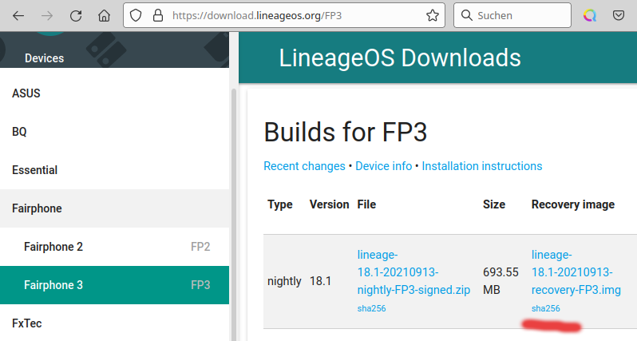
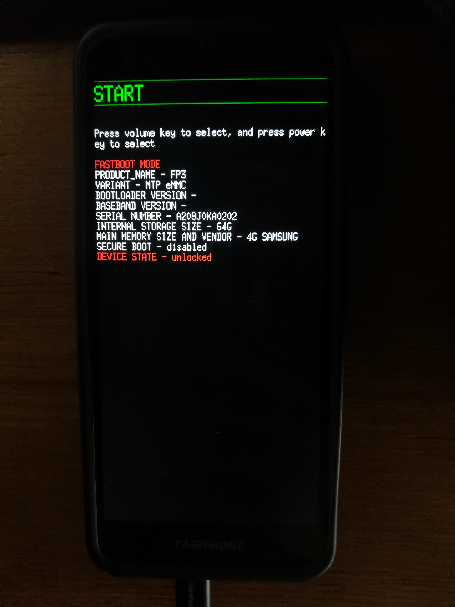
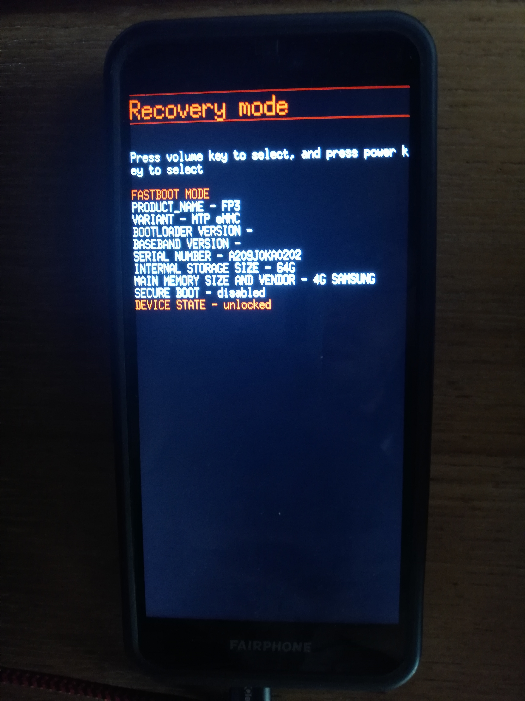
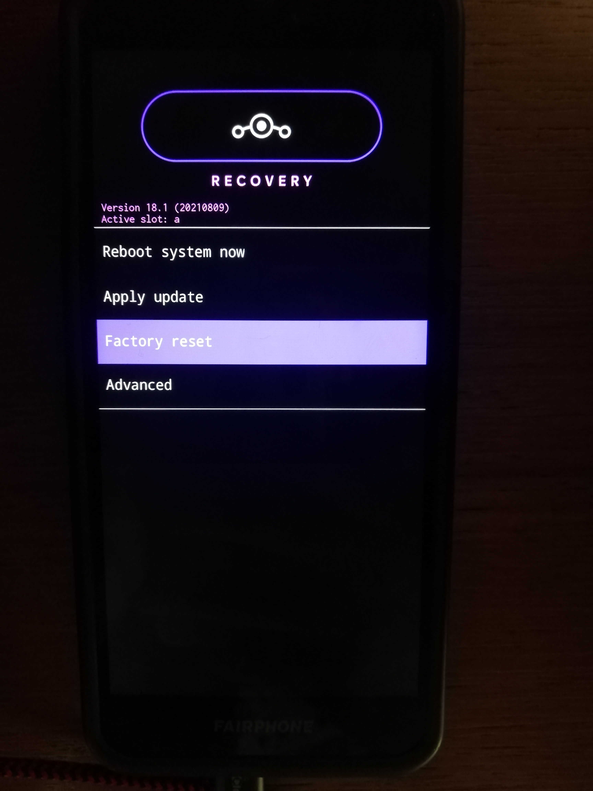
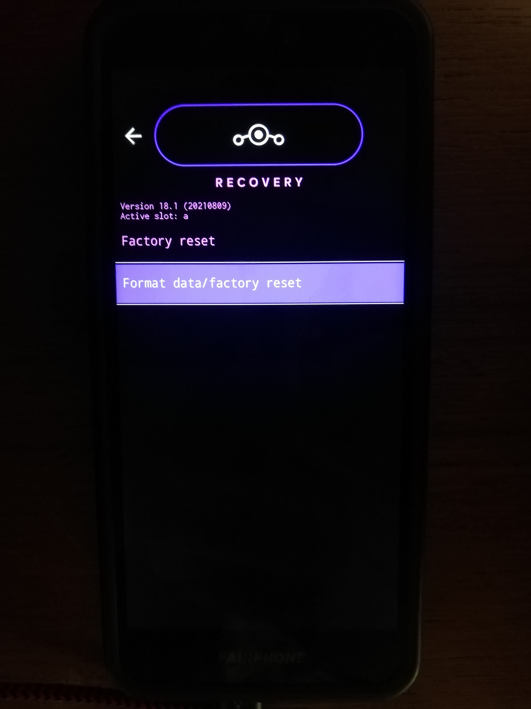
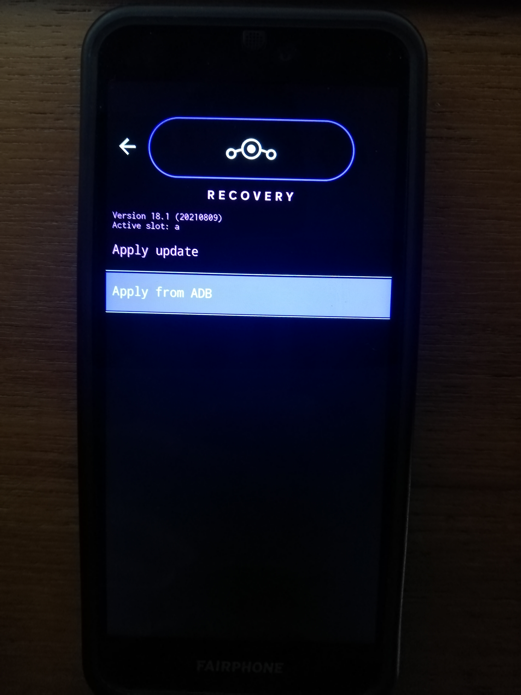
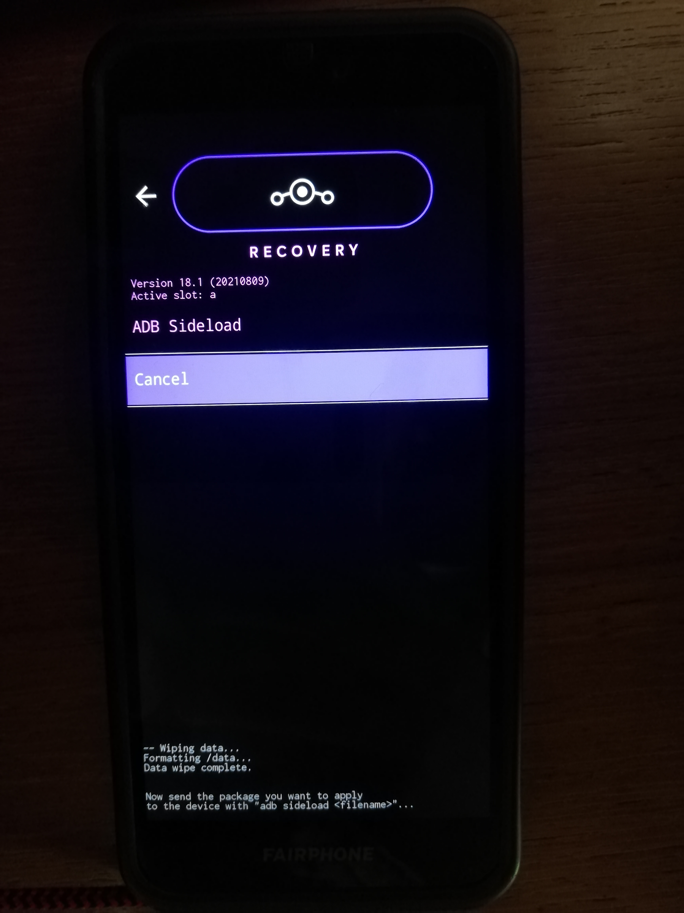
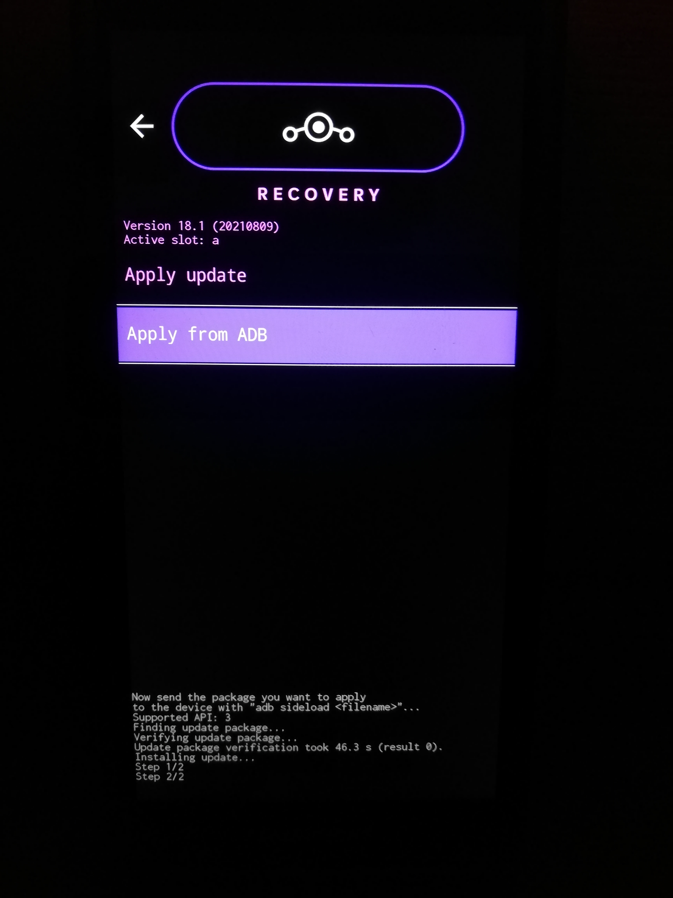

# Install LineageOS on Fairphone

## 1. Check your prerequisites on your computer
[ ] adb and fastboot are installed?  
[ ] you have downloaded bootimage (img) and LineageOS (zip)?  
[ ] you have the unlock code (in case of Fairphone 3)?  
[ ] you have a usb cable prepared?  
[ ] you are prepared to erase all the data on your fairphone?  


## 2. Unlock your fairphone

Unlocking will allow us to overwrite the boot-loader.
1. Navigate to "Settings - About phone"
1. Press 7 times “Build number” to enable Developer mode
1. Navigate to "Settings - System – Advanced – Developer options"
1. Enable USB Debugging
1. In case of Fairphone3:
   1. Navigate to "Settings - System – Advanced – Developer options"
   1. Enable OEM unlocking with unlock your code


## 3. Connect via usb

For overwriting your fairphones boot-loader we will need connection to your pc.
1. Connect your computer & fairphone via usb
1. On your fairphone allow the usb connection
1. Type `adb devices` on your computer (in case of windows open the terminal in the directory containing adb&fastboot.exe and use the `.\` prefix. The resulting command will be: `.\adb devices`).   
   The result should show something like   
   ```
   List of devices attached
   <SerialNumberOfYourPhone>	device
   ```

## 4. Prepare recovery image installation

The next step is the critical one. If this step goes wrong your fairphone may remain broken. Time to do some checks:

1. Check that your phone has at least 50% battery.
1. Reboot your fairphone to bootloader mode: Type `adb reboot bootloader` on your computer.
1. Fairphone should show the bootloader screen.  
1. Type `fastboot devices` on your computer. The result should show something like
   ```
   <SerialNumberOfYourPhone>	fastboot
   ```
1. Check whether your downloaded recovery image is not broken. In case of
   1. windows type `Get-FileHash <image_filename.img>` on your computer.
   1. linux type `sha256sum <image_filename.img>` or alternatively `shasum -a 256 <image_filename.img>` on your computer. 
1. The result should look like   
   ```
   b6494278d0a399547a9344a6018a30b388f71a97ef52989bcdd661002f3a8631  lineage-18.1-20210906-recovery-FP3.img
   ```
1. Now compare the number to the one given on the recovery image download page. Ensure, you are browsing secure with "https".   
[](img/sha256.png)
1. Be aware, in the next step all data will be erased on your fairphone!


## 5. Install LinegaeOS recovery image

All checks passed? Then lets continues:
1. Type on your computer `fastboot oem unlock`.
1. If your fairphone reboots, you might have to do the steps 2.1-2.4 again to re-enable USB debugging. Then `adb reboot bootloader` will bring you back.
1. Install fastboot image & reboot to recovery
   1. in case of Fairphone2 
      1. by typing on your computer `fastboot flash recovery <image_filename.img>` (<image_filename.img> is the img-file you have downloaded in 1.).
      1. With the device powered off, hold Volume Up + Power. Release when boot logo appears.
   1. in case of Fairphone3 
      1. by typing on your computer `fastboot flash boot_b <image_filename.img>` (<image_filename.img> is the img-file you have downloaded in 1.).
      1. On the phone you should not see any difference and you phone should remain in the bootloader screen. Then hold Volume Up + Power. Release when boot logo appears.

Please take care not to boot in to your old Android / FairphoneOS. If you missed the proper reboot into recovery by buttons you've to step back to step 1. because your old os reinstall its own recovery over the one you installed.


## 6. Install LineageOS

This step is no more dangerous. You can retry as often you want to. The LineageOs boot-loader will verify your binaries.
1. Reboot your fairphone again to bootloader mode: Type `adb reboot recovery` on your computer.
2. Your fairphone now boots to the new LineageOS recovery image. Then start the recovery mode.   
[](img/start.jpg)[](img/recovery.jpg)

3. Choose Factory Reset - Format Data/Factory Reset  
[](img/reset.jpg)[](img/format.jpg)
4. Return to main menu
5. Apply update - Apply from ADB  
[](img/apply.jpg)[](img/sideload.jpg)
6. Type `adb sideload <lineagos.zip>` on your computer (<lineagos.zip> is the zip-file you have downloaded in 1.).  
[](img/done.jpg)  

7. Check whether you see the `Step 2/2` on the bottom of your fairphone.


### 6.1 Optional installation of Google Apps

If you can't abstain from the Google Apps or the Google Play Store there exist packages with various scopes, you will find a package comparison here: [https://github.com/opengapps/opengapps/wiki/Package-Comparison](https://github.com/opengapps/opengapps/wiki/Package-Comparison). You have to install Google Aps in front of first the first start wizzard.
1. Download the favored version from [here](https://opengapps.org/).
1. Install the gapps the same way, you installed LineageOs: `adb sideload <gapps.zip>`

## 6. Reboot into LineageOS and prepare for OEM Lock

Reboot the system then your phone should start the installed LineageOS.
Then do again steps 2.1 - 2.4 to re-enable USB-debugging and boot again into fastboot mode with `adb reboot bootloader`.

## 7. OEM Lock

OEM unlocking / locking will erase all data, so we should ensure to do the lock again now.

1. Type `fastboot devices` on your computer. The result should show something like
   ```
   <SerialNumberOfYourPhone>	fastboot
   ```
1. Type on your computer `fastboot oem lock`.


## 8. Start LineageOS

First start of your new LineageOS - hurray.
1. Walk through the initial LineageOS setup.


## 9. Download the F-Droid App-Store

For installing more software we recommend F-Droid 
1. Use the browser on your Fairphone to download F-Droid: [https://www.f-droid.org/](https://www.f-droid.org/)
1. Visit the download-folder and install F-Droid (accept the warning).
1. Now you can install Apps like DeltaChat, NextCloud, Fennec, Tusky, k9 (...) through the F-Droid Store.
1. Open Fennec and install privacy badger as add-on.
